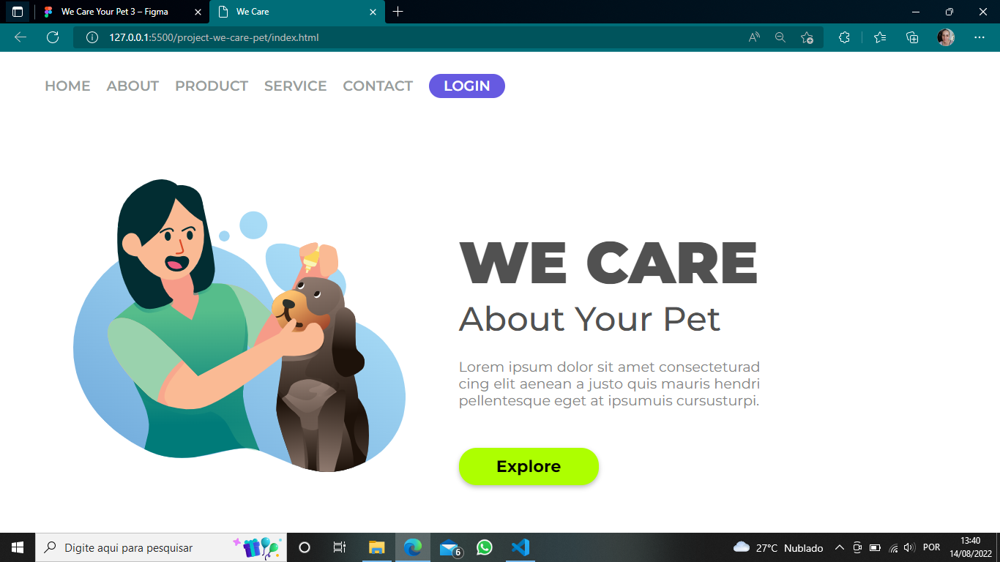

# Project-we-core-pet
 
Project done in the CSS module of the DevClub classes

  

> Project done in the CSS module of DevClub classes, using only HTML and CSS technologies.

## 🤝👩🏻 Collaborator

<table>
  <tr>
    <td align="center">
      <a href="#">
         
        
          <b>Isnaíra Souza</b>
        
      </a>
    </td>
    
</table>
